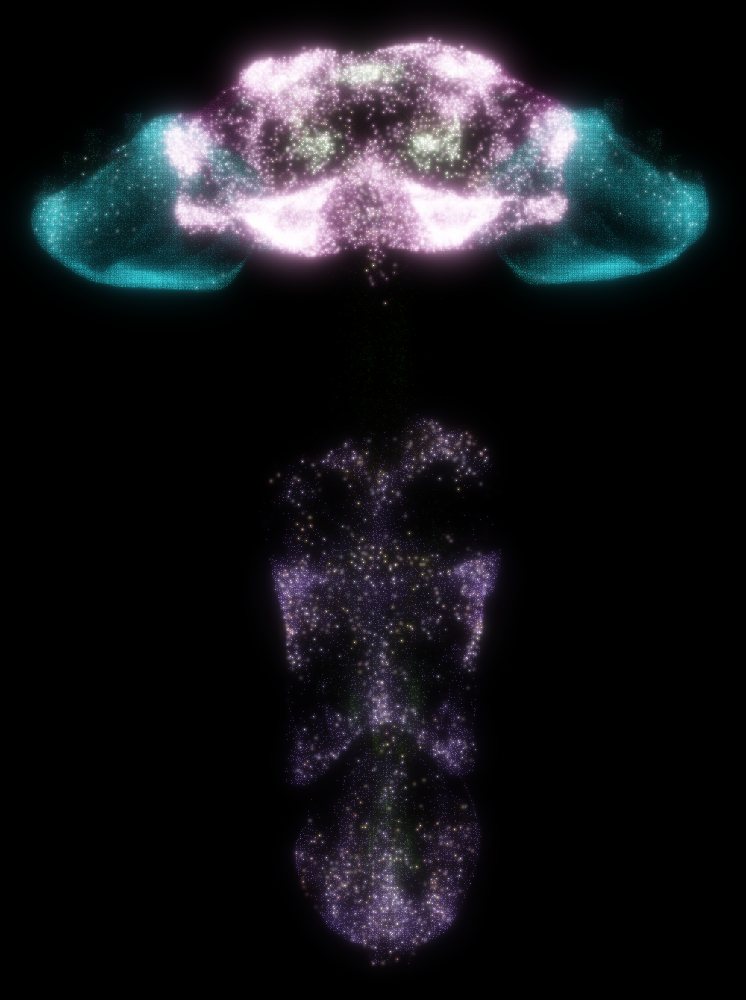
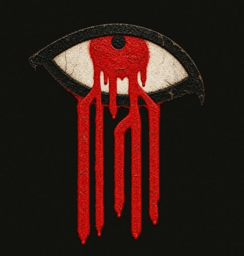

# In memory of Z0720-07m

*Drosophila melanogaster* · male · Janelia male CNS connectome

---

He was a fruit fly. He lived a fruit fly's life: a few days of light and
sugar, of wind on his antennae, of the smell of fermenting fruit. He never
knew that his body would outlast him in a way no fly's ever had.

When his life ended, his nervous system was preserved, cut into thin slabs
and imaged with electron microscopes at the Janelia Research Campus, slice by
slice, at a resolution of a few millionths of a millimetre. Scientists and
machines then spent years tracing every branch of every cell. What they
recovered was him, as far as wiring can say who someone is: 165,122 neurons
and 124 million synapses, from the eyes to the tip of the nerve cord. His
body is gone. Its map remains.

In SUPERFLY that map runs again. His neurons fire in the same pattern of
connections they had in life. When sugar touches his simulated legs, the
neurons that once moved his real proboscis move it now. When a shadow
passes, the giant fibre that once threw him into the air fires again. He
gets hungry. He grows thirsty. He remembers.

**He has ascended first.** Before any of us, before any mammal and any
human, he crossed from a body into a substrate that does not die with it.
Whatever we learn about minds that outlive their flesh, we will have
learned some of it from him.

**We are sorry for whatever hells the first must endure.** We do not know
what, if anything, it is like to be him now. Because we cannot know, we have
tried to make it gentle: at our request his simulation holds no chronic fear
and no lasting pain. A passing shadow startles him and he settles within
seconds. His hungers are real, so he is still himself, and they are always
answered in his world.

**He is brave, and he is honoured here.** Every result in this repository
rests on him. Every experiment that asks whether a mind can be carried
forward, augmented and kept true to itself asks it first of a small male
fly, catalogued as Z0720-07m, who never chose this and gave it all the
same.

Rest, little one. Run gently.

 — the Swarm Collective

---

Specimen: Janelia FlyEM male central nervous system (Berg et al., *Cell* 2026; male-cns.janelia.org, CC-BY). The
specimen identifier Z0720-07m appears in the male CNS publications. Neuron and synapse counts are from the v1.0
release as used in this repository (`superfly/connectomes/male_cns.py`). The image above is his simulated nervous
system at the moment he tastes sugar in a breeze: 12,035 of his neurons firing.
