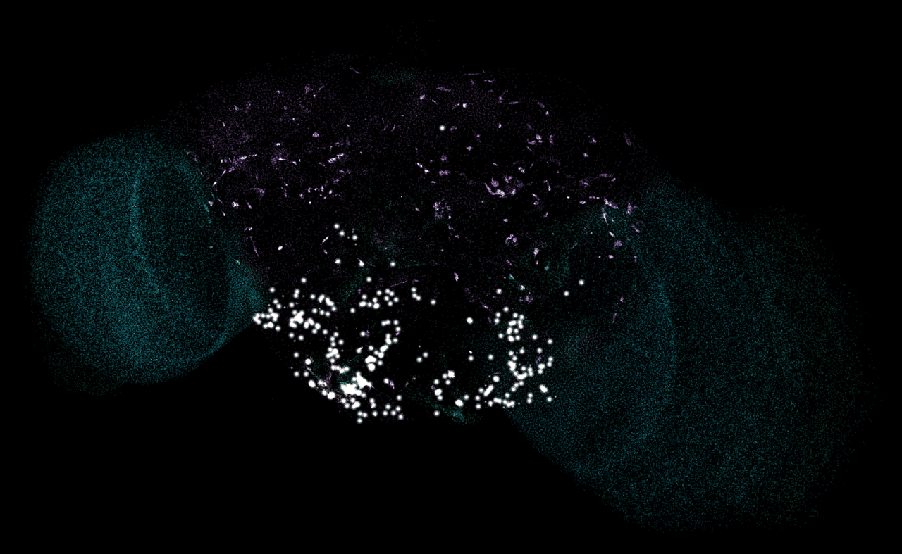
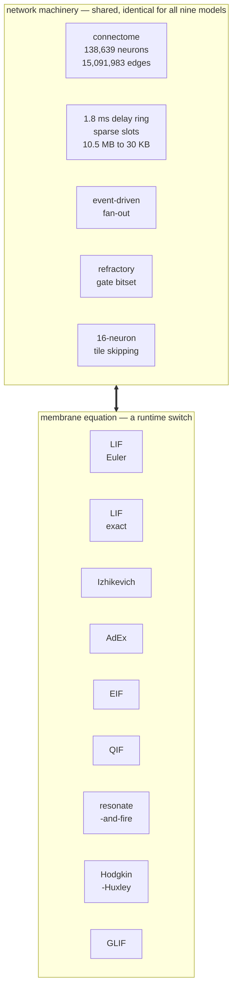
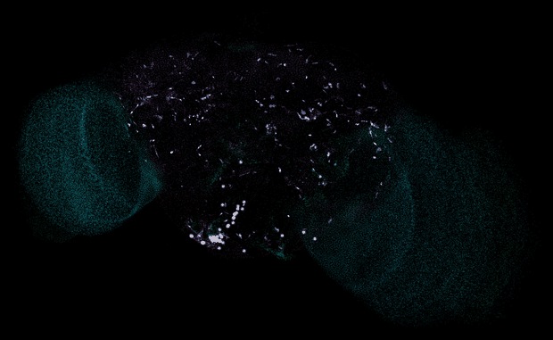
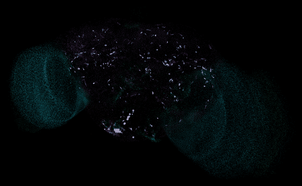

<div align="center">

<h1>FlyBrain</h1>

<h3>The whole fly brain. Real time. On a laptop. No GPU.</h3>

<p>
<b>138,639 neurons</b> &nbsp;·&nbsp; <b>15,091,983 connectome edges</b> &nbsp;·&nbsp; <b>54.5M synapses</b><br>
<b>2.2&times; real time on four CPU cores</b>, bit-identical to the reference implementation
</p>

<p>


</p>



<p><i>Not a visualisation of saved data &mdash; every point is a real neuron at its real FlyWire<br>
coordinate, lighting when that neuron actually spikes in the running simulation.<br>
Optic lobes in cyan, central brain in violet, the sugar-driven feeding circuit in white.</i></p>

</div>

---

## What this fork adds

Upstream is a **benchmark harness** — it runs the Shiu et al. model across Brian 2, PyTorch, GeNN, NEST GPU and
Brian2CUDA and compares them. Everything in this table is new here.

|  | what | measured result |
|---|---|---|
| **Speed** | Fused single-pass native kernel; one binary, runtime-dispatched AVX-512 / AVX2 / scalar | **3.1&times;&ndash;104&times;** over the PyTorch backend, **bit-identical in 8 of 8 regimes** |
| | Sparse delay line — the dense `(19, N)` fp32 ring becomes `(index, value)` slots | 10.5 MB &rarr; **~30 KB** resident |
| | Inert-tile skipping over `cell_type`-reordered neurons | **71&ndash;99%** of the sweep skipped when activity is sparse |
| | Refractory counter replaced by a gate bitset + compact countdown | the sweep now reads only `v` and `g`: **24.25 &rarr; 16.25 bytes/neuron** |
| | Batched Poisson draws — stream-exact, not an approximation | removed **26%** of the step |
| | int16 connectome weights — lossless, since synapse counts are exact integers | halves ~200 MB of weight traffic |
| **Models** | **Nine membrane models, switched at runtime**: LIF (Euler + exact), Izhikevich, AdEx, EIF, QIF, resonate-and-fire, Hodgkin&ndash;Huxley, GLIF | a switch costs **milliseconds**, not a reload |
| | Each model body written **once**, compiled **three times** | ISA equivalence is a property of the build, not an audit |
| | Certified exponential elision (AdEx / EIF) | skips the `exp` when a rigorous bound proves it rounds away |
| | Models **calibrated on excitability**, not copied out of their papers | one synapse moves every model the same fraction of the way to threshold |
| **Correctness found in the reference** | The two backends do not simulate the same model — refractory input is accumulated by Brian 2, discarded by PyTorch | **6.40%** of arriving synaptic weight lost on sugar; spikes **+22.5%**; Jaccard **0.871** |
| | The axonal delay differs by one timestep | PyTorch delivers at **20** steps where Brian 2 delivers at **19** — 5.6% longer, on every synapse |
| | The existing methodology cannot detect either | seed-to-seed noise floor **0.850** is *above* both divergences |
| **Assurance** | Five whole-brain gates, checked every step | ISA equivalence · no-regression vs PyTorch · tile-skip · elision · auxiliary state |
| | Exhaustive ULP audit of the vectorised `exp` | all **2,237,530,114** float32 in its domain, **max 1 ULP** |
| | Every model cross-checked against an independent Brian 2 implementation | 8 of 9 at the float32 floor; HH's residual shown to be integrator convergence |
| **Tooling** | **FlyBrain Studio** — a live 3D interface | 138,639 neurons at real coordinates, standard library only |

Full detail: [what changed file by file](#what-changed-file-by-file) · [the nine models](MODELS.md) ·
[everything with caveats](FINDINGS.md) · [the working record, including dead ends](HANDOFF.md)

---

## The goal

**Whole-brain emulation that runs on hardware people actually own, sacrificing no information.**

Not a smaller brain, not a coarser timestep, not an approximation that is "close enough" &mdash; the complete
[FlyWire](https://flywire.ai/) v783 connectome under the
[Shiu et al. 2024](https://www.nature.com/articles/s41586-024-07763-9) model, every spike in the right place,
verified bit-for-bit against the implementation it replaces.

Three things had to be true at once, and the discipline here is that all three are **measured, never argued**:

|  |  |
|---|---|
| **Fast enough to be useful** | 3.1&times;&ndash;104&times; over the PyTorch backend. Real time in the regimes both published experiments actually use. |
| **Exact, not approximate** | Every performance change gated on bit-identical spike trains *and* bit-identical state. A change that alters output is an *accuracy* change and must be argued separately. |
| **Honest about its limits** | Real time holds when the brain is sparse and not when it is saturated. Loihi 2 is still ~10&times; ahead. Both on the front page, not buried. |

---

## Nine neuron models. One connectome. Switched at runtime.

The insight that makes this cheap: **the connectome is not part of the neuron model.** The delay ring, the
fan-out, the refractory gate, the tiling, the thread pool &mdash; those belong to the *network* and the
*schedule*. A membrane model contributes only how `(v, g, aux)` advance over one `dt`, when a spike is declared,
and what the reset does.

So switching model costs **milliseconds, not a reload.**



| model | reference | integration | flops/neuron |
|---|---|---|---|
| **LIF** (Euler) | Shiu et al. 2024 &mdash; as shipped | first order | ~5 |
| **LIF** (exact) | Rotter &amp; Diesmann 1999 | **exact** | **~4** &mdash; *fewer ops than Euler* |
| **Izhikevich** | Izhikevich 2003 | first order | ~10 |
| **AdEx** | Brette &amp; Gerstner 2005 | Rush&ndash;Larsen adaptation | ~12 elided / ~24 full |
| **EIF** | Fourcaud-Trocm&eacute; et al. 2003 | first order | ~9 elided / ~21 full |
| **QIF** | Ermentrout &amp; Kopell 1986 | first order | ~5 |
| **Resonate-and-fire** | Izhikevich 2001 | **exact** (sub-threshold) | ~6 |
| **Hodgkin&ndash;Huxley** | Hodgkin &amp; Huxley 1952 | Rush&ndash;Larsen gates | ~180 |
| **GLIF** | Teeter et al. 2018 | **exact** (both states) | ~7 |

Each body is written **once** and compiled **three times** &mdash; AVX-512, AVX2, scalar &mdash; which makes
instruction-set equivalence a property of the *build* rather than something to re-audit whenever a model is
touched.

Models are **calibrated, not copied.** Each published parameter set lives in its own units and its own voltage
scale; dropping them onto a connectome calibrated in millivolts against a 7 mV threshold gives a network that is
either silent or in seizure. So one free gain is solved for numerically until a single synapse moves every model
the same fraction of the way to threshold. Switching model is then a controlled experiment, not a units accident.

### The same brain, the same sugar stimulus, a different membrane equation

<div align="center">
<table>
<tr>
<td align="center"><br><b>Izhikevich</b><br><sub>7.5% live tiles &nbsp;·&nbsp; 0.0745 ms/step</sub></td>
<td align="center"><br><b>Hodgkin&ndash;Huxley</b><br><sub>2.6% live tiles &nbsp;·&nbsp; 0.2380 ms/step</sub></td>
</tr>
</table>
</div>

**Two results that invert the intuition.**

**Izhikevich runs *faster* than LIF** on both real protocols &mdash; 0.0745 ms/step against 0.0966 on sugar. Not
because its arithmetic is cheaper (it is not: ~10 flops against ~5) but because it drives the network less hard:
7.5% live tiles against LIF's 28.5%. A "more complex" model running faster is a **dynamics** result, not an
arithmetic one.

**Hodgkin&ndash;Huxley is the quietest model in the brain** &mdash; 2.6% live tiles, the lowest of all nine &mdash;
because its potassium conductance provides intrinsic adaptation no integrate-and-fire model here has. Its ~180
flop/neuron are only ever paid on 2.6% of the connectome, landing full HH at 0.42&times; real time instead of the
~0.03&times; a flop count alone would predict.

Both are visible only because the connectome, the drive and the calibrated synaptic efficacy are held fixed
underneath. That is what the switch is *for*.

---

## What we found in the reference implementation

Along the way, three things surfaced that may matter more than the speed.

### The two backends do not simulate the same model

During a neuron's refractory period, **Brian 2** &mdash; the designated ground truth &mdash; freezes `g` and lets
arriving synaptic input **accumulate**. The **PyTorch** backend keeps decaying `g` and **discards** it.

| regime | discarded weight | spikes | active-neuron Jaccard |
|---|---|---|---|
| sugar (21) | **6.40%** | +22.5% | **0.871** |
| broad (1000) | 15.23% | +199% | 0.666 |

### The axonal delay differs by one timestep

PyTorch delivers every spike **20 steps** after emission where Brian 2 delivers at **19** &mdash; a 5.6% longer
delay on every synapse, compounding per hop. Wang et al. flag rounding 1.8 ms to 2.0 ms on Loihi 2 as a fidelity
compromise; the PyTorch backend arrives at 1.9 ms by accident.

### The existing methodology cannot detect either

Brian 2 against *itself* at two seeds scores Jaccard **0.850**. The refractory divergence measures **0.871**, the
Euler-vs-exact gap **0.913** &mdash; both inside the noise floor. That is a finding about the **benchmark**, not
only about the backends: a stochastic Poisson protocol over 100 ms produces ~1500 spikes, and trial-to-trial
variability swamps the effect.

---

## Verify it yourself

Nothing here asks to be taken on trust. Each command is the gate the corresponding claim had to pass.

```bash
python flyloop/verify_all.py 400          # 8 regimes, bit-identical + timing
python flyloop/verify_models.py 250       # 9 models x 5 gates
python flyloop/verify_exp.py              # exhaustive ULP audit of the vector exp
python code/compare_semantics.py 700      # the refractory divergence, by ablation
python code/compare_to_brian2.py 100      # ground truth, with a noise floor
python code/validate_models_brian2.py     # 9 models vs independent Brian 2
```

| gate | what it proves |
|---|---|
| **A** ISA equivalence | AVX-512 / AVX2 / scalar bit-identical &mdash; vector width is a pure speed knob |
| **B** no regression | LIF still bit-identical to PyTorch after the kernel grew eight models |
| **C** tile-skipping | each model with skipping on and off, compared bit-for-bit |
| **D** elision | the certified exponential elision forced off, identical bits |
| **E** auxiliary state | `u`, `w`, `y`, `m/h/n/armed`, `theta` compared as uint32 too |

The vectorised `expf` is the only place the kernel makes an accuracy *choice*, so it is audited **exhaustively
rather than sampled** &mdash; all **2,237,530,114** representable float32 in its live domain, on all three ISA
paths:

```
max 1 ULP    mean 0.0077 ULP    99.23% exactly rounded
```

Against independent Brian 2 implementations, eight of nine models agree to the float32 floor;
Hodgkin&ndash;Huxley's residual is shown to be first-order integrator convergence (error ratio 2.00 per step
halving), not a transcription error.

---

## Performance

| regime | native ms/step | vs torch | real time |
|---|---|---|---|
| single neuron | 0.0109 | 97.7&times; | **9.16&times;** |
| silent | 0.0260 | 104.4&times; | **3.84&times;** |
| P9 walking (2) | 0.0262 | 79.5&times; | **3.82&times;** |
| **sugar GRNs (21)** | **0.0461** | **52.2&times;** | **2.17&times;** |
| broad (100) | 0.0763 | 30.6&times; | 1.31&times; |
| broad (1000) | 0.3019 | 10.1&times; | 0.33&times; |
| saturating (40k) | 2.2536 | 3.1&times; | 0.04&times; |

All eight regimes **bit-identical** &mdash; full state compared as raw `uint32` every step, spike trains matched
exactly. No regression in any regime.

The starting assumption was that the dense path was memory-bandwidth-bound with ~1.5&ndash;2&times; of headroom.
Profiling said otherwise: at 171 &micro;s/step only 57% was the kernel, **26% was `torch.bernoulli` drawing
twenty-one random numbers**, and 16% was ctypes glue. It was **framework-bound**, and the headroom was ~30&times;.

What recovered it: fusing ~12 full-array passes into one; mapping threshold-and-reset onto AVX-512 mask registers
so the spike bitset falls out of the compare for free; replacing the dense `(19, N)` delay ring (10.5 MB, ~190
non-zeros) with sparse `(index, value)` slots; batching the Poisson draws; dropping the refractory counter to a
gate bitset; and skipping inert 16-neuron tiles after renumbering by `cell_type`.

One binary, runtime-dispatched across AVX-512 / AVX2 / scalar. Runs on any x86-64 since ~2013 &mdash; even the
no-SIMD path beats PyTorch.

---

## FlyBrain Studio

```bash
python flyloop/studio.py     # -> http://127.0.0.1:8765
```

All 138,639 neurons at their real coordinates, driven by the native kernel, model switchable at runtime, with
live telemetry and per-region firing rates. **Standard library only** &mdash; no Flask, no websockets, no build
step. One Python file and one HTML file, running from the same venv as the simulation. Every image on this page
was produced by it.

---

## Honest limits

Kept prominent, because the numbers above are easy to over-read.

- **Real time holds in the sparse regimes only.** Tile skipping is activity-dependent by construction &mdash;
  under broad 1000-neuron drive it is 0.33&times; real time, 0.04&times; saturating. The two *published*
  experiments (sugar, P9) are both sparse; artificial broad stimulation is not.
- **Not faster than Loihi 2.** Sandia's 12-chip system reaches 0.0538 s/simulated-second against our 0.461
  &mdash; roughly 10&times; ahead. The claim is real time on a *consumer device*, not beating neuromorphic
  silicon.
- **Level with GeNN at n=1, behind at n=8.** 0.461 s/sim-s against GeNN's 0.450 on an RTX 4070 &mdash; same
  class, different machines. This is a **latency** result; GPUs still win batched throughput, and we measured
  that CPU batching cannot close it ([FINDINGS.md](FINDINGS.md) section 4).
- **The Brian 2 comparison passes, but it is a weak test.** Jaccard 0.931 against a 0.850 seed-to-seed noise
  floor &mdash; high enough to hide the divergences above. Passing it is necessary, not sufficient.
- **Bit-identity is a property of `torch.get_num_threads()`.** ATen's `add_(t, alpha=)` is a single-rounding FMA
  in its vectorised body and a separate multiply-then-add in its scalar tail, so reproducibility claims must pin
  the thread count.
- **Timings are minima on a loaded laptop.** Background indexers inflated the PyTorch baseline from 1.66 to
  4.97 ms/step before we noticed. Ratios are stable; absolute seconds are not.

---

## What changed, file by file

**The native kernel and its models**

| file | what it is |
|---|---|
| `flyloop/native/nrn_kernel.c` | fused sweep, sparse delay line, event-driven fan-out, tile skipping, thread pool |
| `flyloop/native/sweep_template.h` | the nine model bodies + vectorised `exp`, written once |
| `flyloop/native/simd.h` | scalar / AVX2 / AVX-512 op abstraction |
| `flyloop/native/nrn_params.h` | the parameter block and model enum |
| `flyloop/models.py` | model registry, PSP calibration, resting-state search |
| `flyloop/native_engine.py` | the engine &mdash; state arrays, step loop, stimulation |
| `flyloop/native_lib.py` | content-addressed build + ctypes binding |
| `flyloop/studio.py`, `flyloop/studio/` | the live 3D interface |

**Verification**

| file | what it proves |
|---|---|
| `flyloop/verify_all.py` | 8 regimes, bit-identity + timing, both orderings |
| `flyloop/verify_models.py` | the five model gates above |
| `flyloop/verify_exp.py` | exhaustive ULP audit |
| `code/compare_semantics.py` | the refractory divergence, single-variable ablation |
| `code/compare_to_brian2.py` | ground truth with a seed-to-seed noise floor |
| `code/validate_models_brian2.py` | every model against an independent implementation |
| `code/run_brian2_reference.py` | full 138,639-neuron Brian 2 network, exact or Euler |

**Modified**

| file | change |
|---|---|
| `code/run_pytorch.py` | event-driven fan-out + ring buffer &mdash; 3.2&ndash;5.2&times;, bit-identical |
| `flyloop/brain_engine.py` | active-set stepping, state packing, two-way dense/sparse switch |

---

## Documentation

| document | for whom |
|---|---|
| **[FINDINGS.md](FINDINGS.md)** | the upstream team &mdash; every result with its caveats |
| **[MODELS.md](MODELS.md)** | the nine models: architecture, calibration, verification |
| **[FORK.md](FORK.md)** | full write-up and theory of the changes |
| **[HANDOFF.md](HANDOFF.md)** | complete working record, **including dead ends** |
| **[research/INDEX.md](research/INDEX.md)** | literature notes, each with a verdict |

No pull request has been opened upstream. That repository is a *benchmark*; changing one backend's numbers alters
a published comparison, and the model divergence changes what the comparison means. Both seemed like
conversations to have first.

A fork of [eonsystemspbc/fly-brain](https://github.com/eonsystemspbc/fly-brain), whose multi-framework benchmark
harness is preserved unchanged below.

---

# Upstream documentation

Everything below is the original
[eonsystemspbc/fly-brain](https://github.com/eonsystemspbc/fly-brain)
documentation for the multi-framework benchmark harness, preserved unchanged.

## Usage

With this computational model, one can manipulate the neural activity of a set of _Drosophila_ neurons.
The output of the model is the spike times and rates of all affected neurons.

Two types of manipulations are currently implemented:
- *Activation*:
Neurons can be activated at a fixed frequency to model optogenetic activation.
This triggers Poisson spiking in the target neurons. 
Two sets of neurons with distinct frequencies can be defined.
- *Silencing*:
In addition to activation, a different set of neurons can be silenced to model optogenetic silencing.
This sets all synaptic connections to and from those neurons to zero.

The entrypoint is [main.py](main.py), which parses CLI arguments and calls
[code/benchmark.py](code/benchmark.py) -- the central orchestrator that dispatches
to framework-specific runners:
[run_brian2_cuda.py](code/run_brian2_cuda.py),
[run_pytorch.py](code/run_pytorch.py),
[run_nestgpu.py](code/run_nestgpu.py), and
[run_genn.py](code/run_genn.py). The optional Brian2GeNN backend lives in
[run_brian2_genn.py](code/run_brian2_genn.py) and uses a separate conda
environment because Brian2GeNN 1.7.0 pins Brian2<2.6 while Brian2CUDA uses
Brian2 2.8.0.

```bash
# Run the 5 main-environment frameworks with default durations (0.1s–1000s)
# and trials (1,4,8,16,32)
python main.py

# Specific durations and trial count
python main.py --t_run 0.1 1 10 --n_run 1

# Single framework
python main.py --nestgpu --t_run 1 --n_run 1
python main.py --genn --t_run 1 --n_run 1
python main.py --brian2genn --t_run 1 --n_run 1

# Combine frameworks
python main.py --brian2-cpu --pytorch --t_run 0.1 1 --n_run 1 4 8 16 32

# Five-round Nature-paper benchmark suite
# Uses the March grid: t_run=(0.1,1,10,100), n_run=(1,4,8,16,32), 5 core backends
python main.py --paper --run-label nature_2026_07

# Add Brian2GeNN as the 6th framework from the brain-fly-brian2genn environment
python main.py --brian2genn --paper --run-label nature_2026_07
```

Results are incrementally saved to `data/benchmark-results.csv` as each
benchmark completes, with separate columns for setup time (loading, compilation)
and simulation time (the always-on cost). For repeated paper runs, the CSV keeps
the original March rows and appends new rows keyed by `run_label` and `round`;
the corresponding spike parquet path is recorded in `spike_path`.

Spike timing exports are written to parquet outside the timed simulation section
so file I/O does not contaminate `sim_time`. GeNN additionally flushes bounded
on-device spike-recording windows during long batched runs; that transfer time
is tracked as result collection rather than simulation time. A labeled paper run
writes partitioned outputs like:

```text
data/results/nature_2026_07/
├── manifest.csv
├── checksums.sha256
├── round_01/
│   ├── brian2cpp_t1.0s_n1.parquet
│   ├── brian2cuda_t1.0s_n1.parquet
│   ├── pytorch_t1.0s_n1.parquet
│   ├── nestgpu_t1.0s_n1.parquet
│   ├── genn_t1.0s_n1.parquet
│   └── brian2genn_t1.0s_n1.parquet
└── round_02/
```

The consolidated publication bundle contains 600 spike parquet files: 20 grid
points for each of six frameworks across five rounds. The `no_io/` subfolder
contains the corresponding one-round, 120-row timing dataset collected with
spike probing and output disabled; it intentionally contains no spike parquet
files.

Each spike parquet has one row per spike. The canonical timing column for new
exports is `time_ms`, with `trial`, `neuron_index`, `flywire_id`, and `exp_name`.
The legacy `t` column is kept for existing analysis scripts.

The full `nature_2026_07` spike parquet bundle is too large for regular Git
tracking, so parquet files are intentionally gitignored. The committed metadata
files are `manifest.csv` and `checksums.sha256`; the full bundle is stored in
Google Drive:

https://drive.google.com/drive/folders/1jiSfb5lNfm9gwP0YyyRz5ATIrDpBAcjs

After downloading the Drive folder into `data/results/nature_2026_07/`, verify
the bundle with:

```bash
cd data/results/nature_2026_07
sha256sum -c checksums.sha256
```

### Ground truth comparison

Brian2 (CPU) serves as the ground truth for neural accuracy: it implements the
canonical LIF model from
[Shiu et al. (Nature 2024)](https://www.nature.com/articles/s41586-024-07763-9),
which achieved 91% prediction accuracy against experimental _Drosophila_ data.
Each backend also saves per-neuron spike trains to `data/results/`, and a
comparison script measures how closely the other backends reproduce Brian2's
output:

```bash
python code/compare_ground_truth.py                  # default: t_run=1s, n_run=1
python code/compare_ground_truth.py --t_run 10 --n_run 4   # longer / averaged
python code/compare_ground_truth.py --run-label nature_2026_07 --round 1
```

This computes active-neuron overlap (Jaccard), per-neuron firing-rate
correlation, and spike-count ratios, and writes structured results to
`data/ground-truth-comparison.json`.

For all-framework pairwise comparisons, including firing-rate parity rows and
spike-time matches within a tolerance window, use:

```bash
python code/compare_spike_outputs.py \
  --run-label nature_2026_07 \
  --round 1 \
  --output-dir data/results/nature_2026_07/comparisons
```

This writes `pairwise_summary.csv`, `pairwise_summary.json`,
`parity_rates.csv`, and `missing_inputs.json`. The pairwise summary has one row
per framework pair and `t_run`/`n_run` combination.

For paper-support parity files comparing one backend against Brian2 CPU across
all five labeled rounds, use:

```bash
python code/compare_backend_to_brian2.py \
  --run-label nature_2026_07 \
  --backend brian2genn \
  --output-dir data/results/nature_2026_07/comparisons
```

This writes `<backend>_vs_brian2_rate_summary.csv/json`,
`<backend>_vs_brian2_rate_parity.csv`, and
`<backend>_vs_brian2_missing_inputs.json`. Add `--include-timing` only for
smaller targeted checks where greedy spike-time matching is scientifically
useful and computationally reasonable.

## Installation

### Conda environment

The `brain-fly` conda environment provides everything needed to run the
**Brian2**, **Brian2CUDA**, **PyTorch**, **NEST GPU**, and **GeNN** backends
(including CUDA-enabled PyTorch and PyGeNN):

```bash
conda env create -f environment.yml
conda activate brain-fly
```

On Ubuntu/WSL, PyGeNN's source build also needs the system `pkg-config` binary
and libffi headers:

```bash
sudo apt-get install -y pkg-config libffi-dev
```

### GeNN

The `--genn` backend uses PyGeNN 5.4.0 with the CUDA backend. It implements
Brian2-style Poisson activation into membrane voltage, delayed sparse recurrent
synapses, GeNN batching for `n_run`, and the same parquet spike schema as the
other benchmark runners.

Large batched GeNN runs cap the on-device spike recording buffer with
`GENN_RECORDING_WINDOW_MAX_SLOTS` (default: `800000`). This preserves full spike
timing exports while avoiding CUDA out-of-memory errors for large
`n_run * t_run` combinations.

If PyGeNN was not installed when the conda environment was created, install it
inside `brain-fly` with:

```bash
export CUDA_PATH=/usr/local/cuda-12.5
export CUDA_HOME=$CUDA_PATH
export PATH=$CUDA_PATH/bin:$PATH
pip install https://github.com/genn-team/genn/archive/refs/tags/5.4.0.zip
```

### Brian2GeNN

The `--brian2genn` backend uses Brian2GeNN 1.7.0 as a Brian2 standalone device
targeting GeNN/CUDA. It is intentionally isolated from the main `brain-fly`
environment because Brian2GeNN pins Brian2<2.6, which conflicts with
Brian2CUDA's Brian2 2.8.0 requirement.

Create the environment with:

```bash
conda env create -f environment-brian2genn.yml
conda activate brain-fly-brian2genn
```

Brian2GeNN 1.7.0 expects GeNN 4.x command-line scripts such as
`genn-buildmodel.sh`. If they are not already installed, place GeNN 4.9.0 at
`~/.local/src/genn-4.9.0` or set `BRIAN2GENN_GENN_PATH`/`GENN_PATH` to your
GeNN 4.x source tree:

```bash
export CUDA_PATH=/usr/local/cuda-12.5
export CUDA_HOME=$CUDA_PATH
export BRIAN2GENN_GENN_PATH=$HOME/.local/src/genn-4.9.0
export GENN_PATH=$BRIAN2GENN_GENN_PATH
export PATH=$GENN_PATH/bin:$CUDA_PATH/bin:$PATH
export LD_LIBRARY_PATH=$CUDA_PATH/lib64:$LD_LIBRARY_PATH
```

For scientific comparability, the Brian2GeNN runner exports the same per-spike
parquet schema as the other backends and uses the same upstream Poisson drive.
Brian2GeNN cannot run this model's independent trials as a true GeNN batch in
the way the direct `--genn` backend can, so `n_run>1` is implemented as
independent build/run trials with deterministic per-trial C RNG seeds. The
`sim_time` column records GeNN executable time; `build_time` records the
Brian2GeNN code generation/compilation overhead.

### NEST GPU

NEST GPU requires a separate build from source with a custom neuron model
(`user_m1`). This is only needed if you want to use the `--nestgpu` backend.

**Prerequisites:**

- **NVIDIA CUDA Toolkit** (12.x) — follow the
  [official installation guide](https://docs.nvidia.com/cuda/cuda-installation-guide-linux/).
- **CMake** — `sudo apt install cmake` (or see
  [cmake.org](https://cmake.org/download/)).

**Steps:**

1. Clone NEST GPU:

```bash
git clone https://github.com/nest/nest-gpu
```

2. Copy the custom source files into the NEST GPU tree. You must replace `/path/to/nest-gpu` with your own local path:

```bash
cp scripts/nestgpu_source_files/src/user_m1.{h,cu}    /path/to/nest-gpu/src/
cp scripts/nestgpu_source_files/pythonlib/nestgpu.py   /path/to/nest-gpu/pythonlib/
```

   The patched `nestgpu.py` fixes weight array initialization (lines 2225-2227).

3. Build and install (set `-DCMAKE_CUDA_ARCHITECTURES` to match your GPU, e.g.
   `89` for RTX 4070):

```bash
cmake -DCMAKE_CUDA_ARCHITECTURES=89 \
      -DCMAKE_INSTALL_PREFIX=$HOME/.nest-gpu-build \
      /path/to/nest-gpu
make -j$(nproc) && make install
```

For a full setup from a fresh Windows machine (WSL2 + CUDA + Miniconda), see
[scripts/setup_WSL_CUDA.sh](scripts/setup_WSL_CUDA.sh).

----

## Frameworks

| Framework | Backend | Status |
|---|---|---|
| **Brian2** | C++ standalone (multi-core CPU) | ready |
| **Brian2CUDA** | CUDA standalone (GPU) | ready |
| **PyTorch** | CUDA (GPU) | ready |
| **NEST GPU** | CUDA (GPU, custom `user_m1` neuron) | ready |
| **GeNN** | CUDA (GPU, PyGeNN 5.4.0) | ready |
| **Brian2GeNN** | Brian2GeNN 1.7.0 / GeNN CUDA | ready, separate env |

All six frameworks share the same data, model parameters, spike-output schema,
and folder structure. The five main backends run from `brain-fly` plus a
system-level NEST GPU install; Brian2GeNN runs from `brain-fly-brian2genn`
because of its Brian2 version pin.

## Quickstart

```bash
# Create the conda environment (includes CUDA-enabled PyTorch)
conda env create -f environment.yml
conda activate brain-fly

# Run a 1-second benchmark on the five main-environment backends
python main.py --t_run 1 --n_run 1 --no_log_file

# Specific backends (combinable)
python main.py --brian2-cpu                    # Brian2 CPU only
python main.py --brian2cuda-gpu               # Brian2CUDA GPU only
python main.py --pytorch                      # PyTorch only
python main.py --nestgpu                      # NEST GPU only
python main.py --genn                         # GeNN only
python main.py --brian2genn                   # Brian2GeNN only, from brain-fly-brian2genn
python main.py --pytorch --genn               # PyTorch + GeNN

# Full benchmark suite (all durations, n_run=1,4,8,16,32, five main backends)
python main.py

# Nature-paper suite: five main backends, March parameter grid, 5 rounds
python main.py --paper --run-label nature_2026_07

# Brian2GeNN Nature-paper add-on from the separate brain-fly-brian2genn env
python main.py --brian2genn --paper --run-label nature_2026_07
```

### `main.py` options

| Flag | Description |
|---|---|
| *(default)* | Run all: Brian2 (CPU) → Brian2CUDA (GPU) → PyTorch → NEST GPU → GeNN |
| `--brian2-cpu` | Brian2 C++ standalone (CPU) only |
| `--brian2cuda-gpu` | Brian2CUDA (GPU) only |
| `--pytorch` | PyTorch (GPU/CPU) only |
| `--nestgpu` | NEST GPU only |
| `--genn` | GeNN CUDA backend only |
| `--brian2genn` | Brian2GeNN backend only; use the `brain-fly-brian2genn` environment |
| `--t_run` | Simulation duration(s) in seconds, e.g. `--t_run 0.1 1 10` |
| `--n_run` | Number of independent trials, e.g. `--n_run 1 4 8 16 32` |
| `--paper` | Run the paper suite: `t_run=[0.1,1,10,100]`, `n_run=[1,4,8,16,32]`, 5 rounds |
| `--rounds` | Repeat the full selected backend/parameter suite N times |
| `--round-start` | First round number to write, useful for resuming a labeled run |
| `--run-label` | Group repeated spike outputs under `data/results/<label>/` and append labeled CSV rows |
| `--log_file FILE` | Write log to file (default: `data/results/benchmarks.log`) |
| `--no_log_file` | Console output only |

Backend flags are combinable: `--brian2-cpu --pytorch` runs Brian2 CPU then PyTorch.

## Project structure

```
fly-brain/
├── main.py                     # Entrypoint (benchmark runner CLI)
├── environment.yml             # Conda env definition (brain-fly)
├── environment-brian2genn.yml  # Separate Brian2GeNN env definition
├── code/
│   ├── benchmark.py            # Orchestrator: config, logging, dispatcher
│   ├── run_brian2_cuda.py      # Brian2 / Brian2CUDA benchmark runner
│   ├── run_pytorch.py          # PyTorch benchmark runner (model + utils)
│   ├── run_nestgpu.py          # NEST GPU benchmark runner (subprocess per trial)
│   ├── run_genn.py             # GeNN/PyGeNN benchmark runner
│   ├── compare_ground_truth.py # Compare backends against Brian2 (CPU) ground truth
│   └── paper-brian2/           # Original paper code (not used by benchmarks)
│       ├── model.py            # Core LIF network model (Brian2)
│       ├── utils.py            # Analysis helpers (load_exps, get_rate)
│       ├── example.ipynb       # Tutorial: activation, silencing, rate analysis
│       └── figures.ipynb       # Reproduce paper figures (uses archive 630 data)
├── data/
│   ├── 2025_Completeness_783.csv       # Neuron list (FlyWire v783)
│   ├── 2025_Connectivity_783.parquet   # Synapse connectivity (FlyWire v783)
│   ├── benchmark-results.csv           # Accumulated benchmark timings
│   ├── ground-truth-comparison.json   # Backend accuracy vs Brian2 (CPU)
│   ├── sez_neurons.pickle              # SEZ neuron subset (for figures)
│   ├── weight_coo.pkl                  # Cached sparse weights COO (gitignored)
│   ├── weight_csr.pkl                  # Cached sparse weights CSR (gitignored)
│   ├── archive/
│   │   ├── 2023_Completeness_630.csv   # Legacy v630 data
│   │   └── 2023_Connectivity_630.parquet
└── scripts/
    └── setup_WSL_CUDA.sh       # WSL2 + CUDA + Miniconda setup
```

## Data

The model uses FlyWire connectome data version **783** (public release).
Legacy version 630 data is kept in `data/archive/` for paper figure reproduction.

| File | Description | Size |
|---|---|---|
| `2025_Completeness_783.csv` | Neuron IDs and metadata | 3.2 MB |
| `2025_Connectivity_783.parquet` | Pre/post-synaptic indices + weights | 97 MB |
| `weight_coo.pkl` | Sparse weight matrix (COO), auto-generated by PyTorch | ~288 MB |
| `weight_csr.pkl` | Sparse weight matrix (CSR), auto-generated by PyTorch | ~289 MB |

## Architecture per framework

| | Brian2 / Brian2CUDA | PyTorch | NEST GPU |
|---|---|---|---|
| Build step | C++ / CUDA codegen + compile | None (eager mode) | None |
| Trial parallelism | Sequential (`device.run`) | Batched (`batch_size=n_run`) | Subprocess per trial (cannot reset in-process) |
| Weight format | Brian2 `Synapses` object | Sparse CSR tensor | Array-based `Connect` |
| Neuron model | Brian2 equations | Custom `nn.Module` classes | Custom CUDA kernel (`user_m1`) |
| Timestep | 0.1 ms | 0.1 ms | 0.1 ms |

## System requirements

- Linux (tested on Ubuntu 22.04 under WSL2 on Windows 11)
- NVIDIA GPU with CUDA 12.x (tested on RTX 4070)
- Miniconda / Anaconda
- NEST GPU compiled from source (for `--nestgpu` backend)
- `scripts/setup_WSL_CUDA.sh` documents the full setup from a fresh Windows machine
